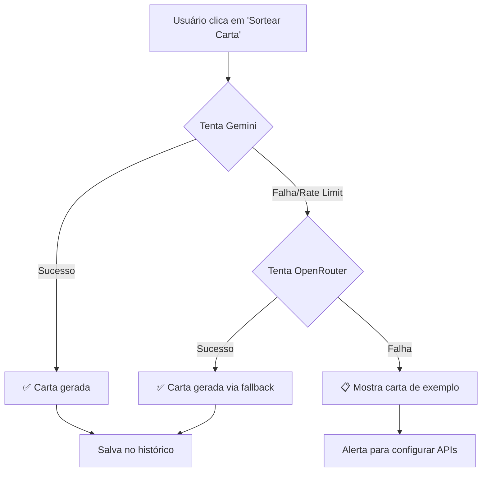

# Perfil Forever - Gerador Infinito de Cartas

**Perfil Forever** é uma versão web infinita e inteligente do clássico jogo de tabuleiro "Perfil". Este projeto utiliza **Inteligência Artificial** para gerar cartas de jogo dinamicamente, garantindo que você nunca fique sem novos desafios.

## 🤖 Sistema de IA com Fallback Automático

O projeto implementa um sistema resiliente de geração de conteúdo com **dupla camada de IA**:

1. **🎯 Primário**: Google Gemini 2.5 Flash (via SDK oficial)
2. **🔄 Fallback**: OpenRouter com Xiaomi MiMo V2 Flash (100% GRATUITO)

Quando o Gemini direto falha ou atinge limites de rate, o sistema automaticamente tenta o OpenRouter, garantindo **disponibilidade contínua** sem interrupções para o jogador.

## 🎮 Como Jogar

O objetivo é descobrir a **Pessoa**, **Lugar**, **Objeto** ou **Ano** secreto com o menor número de dicas possível.

1.  **Sorteio**: Clique em "Sortear Nova Carta". A IA irá gerar um perfil secreto com 20 dicas.
2.  **Dicas**: Você verá um painel com botões numerados de 1 a 20.
    *   Ao clicar em um número, uma dica é revelada.
    *   **Atenção**: As dicas são apresentadas em ordem aleatória para você (o botão 1 pode ser uma dica fácil ou difícil), mas a IA gera as dicas seguindo uma lógica de dificuldade.
3.  **Palpite**: A qualquer momento, tente adivinhar quem ou o que é o perfil com base nas dicas reveladas.
4.  **Resposta**: Clique em "Revelar Resposta" para conferir se acertou.

## ✨ Funcionalidades

*   **🤖 Geração Infinita via IA**: Utiliza Google Gemini 2.5 Flash para criar cartas únicas e criativas sempre que você joga.
*   **🔄 Sistema de Fallback Inteligente**: Se o Gemini direto falhar, automaticamente usa OpenRouter (Xiaomi MiMo V2 Flash - GRÁTIS) sem interromper a experiência.
*   **📊 Categorias**: Escolha entre:
    *   👤 Pessoa (celebridades, personagens históricos, atletas)
    *   🌍 Lugar (cidades, países, pontos turísticos)
    *   📦 Objeto (produtos, invenções, comida, animais)
    *   📅 Ano (eventos históricos marcantes)
    *   🔀 Todas (sorteio aleatório entre categorias)
*   **⚙️ Níveis de Dificuldade Configuráveis**:
    *   😊 Fácil - Temas populares e conhecidos
    *   🤔 Médio - Temas variados
    *   🤯 Difícil - Temas obscuros e desafiadores
    *   🎲 Múltipla escolha - Sorteia aleatoriamente entre as dificuldades selecionadas
*   **💡 Sistema de Dicas Progressivas**: 20 dicas geradas pela IA, das mais genéricas às mais óbvias.
*   **🔀 Ordem Aleatória**: As dicas são embaralhadas, tornando cada partida imprevisível.
*   **📝 Histórico Anti-Repetição**: Rastreia cartas já jogadas para evitar repetições.
*   **🎨 Interface Moderna**: Design responsivo com Tailwind CSS, animações suaves e gradientes vibrantes.

## 🛠️ Tecnologias Utilizadas

*   [React](https://react.dev/) - Biblioteca para construção da interface
*   [TypeScript](https://www.typescriptlang.org/) - Tipagem estática para JavaScript
*   [Vite](https://vitejs.dev/) - Ferramenta de build rápida e leve
*   [Tailwind CSS](https://tailwindcss.com/) - Framework CSS utilitário para estilização
*   [Lucide React](https://lucide.dev/) - Biblioteca de ícones
*   [@google/genai](https://www.npmjs.com/package/@google/generative-ai) - SDK oficial do Google Gemini
*   [OpenRouter API](https://openrouter.ai/) - Gateway de múltiplos modelos de IA (usado como fallback)

## 🚀 Instalação e Execução

### Pré-requisitos

*   Node.js 16+ e npm instalados
*   Chave de API do Google Gemini ([obtenha aqui](https://makersuite.google.com/app/apikey))
*   *(Opcional)* Chave do OpenRouter para fallback ([obtenha aqui](https://openrouter.ai/keys))

### Passo a Passo

1.  **Clone o repositório:**
    ```bash
    git clone <seu-repositorio>
    cd perfil-forever
    ```

2.  **Instale as dependências:**
    ```bash
    npm install
    ```

3.  **Configure as variáveis de ambiente:**
    
    Crie um arquivo `.env` na raiz do projeto:
    ```bash
    # API Principal
    VITE_GEMINI_API_KEY=sua_chave_gemini_aqui

    # API de Fallback (opcional mas recomendado)
    VITE_OPENROUTER_API_KEY=sua_chave_openrouter_aqui
    ```

4.  **Execute o servidor de desenvolvimento:**
    ```bash
    npm run dev
    ```

5.  **Acesse no navegador:**
    ```
    http://localhost:5173
    ```

## 🔑 Configuração das APIs

### Google Gemini (Principal)

1. Acesse [Google AI Studio](https://makersuite.google.com/app/apikey)
2. Crie uma nova API key
3. Adicione ao arquivo `.env`:
   ```
   VITE_GEMINI_API_KEY=sua_chave_aqui
   ```

### OpenRouter (Fallback - Opcional)

O OpenRouter é usado como **backup automático** quando o Gemini falha. Recomendado para garantir alta disponibilidade.

1. Acesse [OpenRouter](https://openrouter.ai/keys)
2. Crie uma conta e gere uma API key
3. Adicione ao arquivo `.env`:
   ```
   VITE_OPENROUTER_API_KEY=sua_chave_aqui
   ```

**Modelo atual**: `xiaomi/mimo-v2-flash:free` (100% GRATUITO! 🆓)

## 🔄 Como Funciona o Sistema de Fallback



### Cenários Tratados

| Cenário | Comportamento |
|---------|---------------|
| ✅ Gemini OK | Usa Gemini normalmente |
| ⚠️ Gemini rate limit | Automaticamente tenta OpenRouter |
| ⚠️ Gemini offline | Automaticamente tenta OpenRouter |
| ❌ Ambos falharam | Mostra carta de exemplo (Einstein) |
| 🔑 Sem API keys | Alerta para configurar no `.env` |

### Monitoramento

Abra o **Console do Navegador** (F12) para ver logs em tempo real:

```
✅ Carta gerada com Gemini
```
ou
```
⚠️ Gemini falhou: [detalhes do erro]
🔄 Tentando com OpenRouter (fallback - Xiaomi MiMo V2 Flash)...
✅ Carta gerada com OpenRouter (fallback)
ℹ️ Esta carta foi gerada com OpenRouter (Gemini direto indisponível)
```

## ⚙️ Personalizações Avançadas

### Trocar Modelo do OpenRouter

Por padrão usamos **Xiaomi MiMo V2 Flash** (100% gratuito), mas você pode trocar para outros modelos.

Edite o arquivo [`src/App.tsx`](src/App.tsx) na função `tryOpenRouter()`:

```typescript
model: 'xiaomi/mimo-v2-flash:free',  // Modelo atual (GRATUITO)
```

**Outras opções de baixo custo:**

```typescript
// GPT-3.5 Turbo (mais barato)
model: 'openai/gpt-3.5-turbo'

// Gemini Pro 1.5 (mais rápido)
model: 'google/gemini-pro-1.5'

// Claude Haiku (melhor qualidade)
model: 'anthropic/claude-3-haiku'
```

**Modelos gratuitos** (se disponíveis, mas podem ter limitações):

```typescript
// Nota: Modelos gratuitos no OpenRouter mudam com frequência.
// Consulte https://openrouter.ai/models para a lista atualizada.
// Recomendamos usar modelos de baixo custo para garantir disponibilidade.
```

Veja a lista completa em [OpenRouter Models](https://openrouter.ai/models).

## 📊 Estimativa de Custos

Com o modelo **Xiaomi MiMo V2 Flash** (100% GRATUITO):

| Uso | Cartas Geradas | Custo |
|-----|----------------|-------|
| Leve | ~100 cartas/mês | **$0.00** 🆓 |
| Médio | ~1.000 cartas/mês | **$0.00** 🆓 |
| Intenso | ~10.000 cartas/mês | **$0.00** 🆓 |

**Gemini direto**: Free tier com limites generosos (usado como primário).

> 💡 **Dica**: Ambas as APIs são gratuitas! O OpenRouter só é acionado quando o Gemini atinge limites, garantindo disponibilidade contínua sem custos.

## 💾 Persistência de Dados

O projeto usa `window.storage` (API customizada) para salvar o histórico de cartas jogadas.

Para ambientes padrão:
- Em desenvolvimento, a funcionalidade pode falhar silenciosamente
- O histórico será mantido na sessão atual
- Para produção, considere implementar `localStorage` como alternativa

---

**Divirta-se jogando Perfil infinitamente!** 🎲✨
